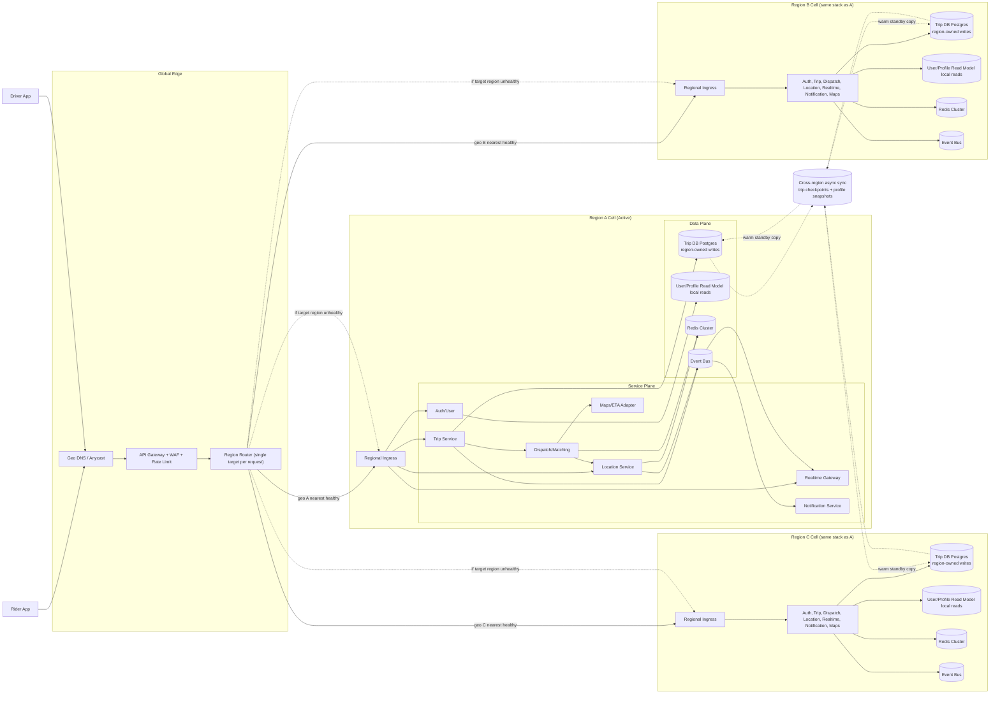
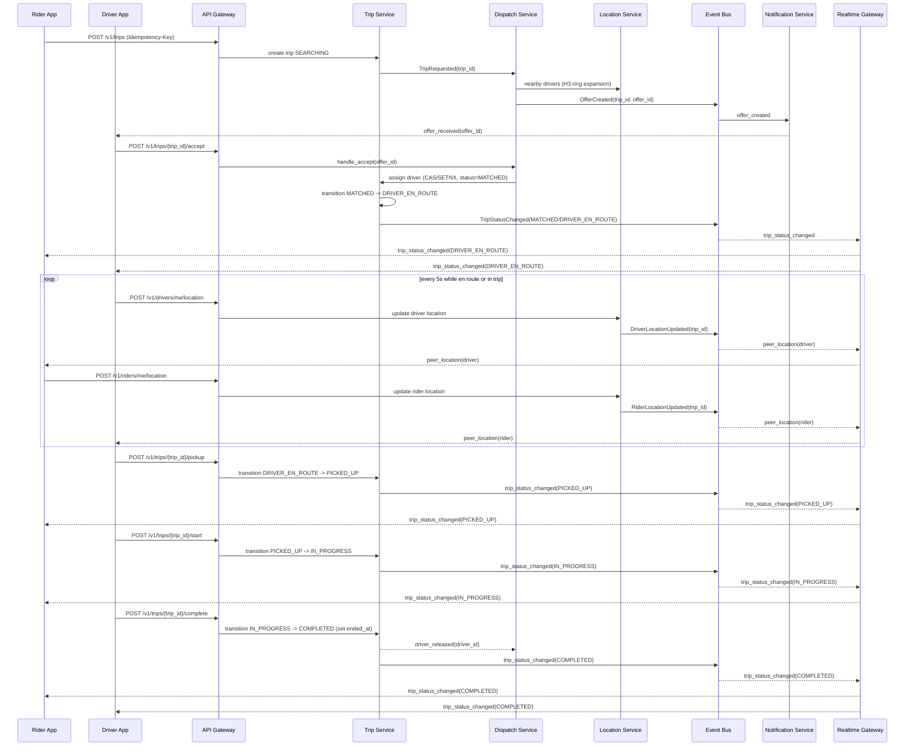

## Step 1 — Clarify scope + assumptions + rough estimation

### 1) Scope (MVP)

* **Core flows**
  * Riders and drivers register and log in before using trip features
  * Drivers must pass onboarding verification (for example: license and insurance) before they can be marked `AVAILABLE`
  * Rider requests a trip -> system finds nearby drivers -> batch offers -> driver accepts/declines -> trip starts/ends
  * After match, rider and driver can see each other's location until trip is finished (WebSockets + push fallback)
* **Out of scope**
  * Payments, pricing/surge, ratings, chat, route navigation UI, promotions
  * We still include a minimal Maps/ETA adapter because dispatch quality depends on ETA

### 2) Key assumptions

* **Given:** 10M daily active riders, 1M daily active drivers
* **[Assumption]** Active rider trip frequency: 2-3 trips/day, use 2.5 for sizing
* **[Assumption]** Average trip duration: 15 minutes
* **[Assumption]** Peak multiplier: 5x average traffic
* **[Assumption]** Driver location update interval: every 5 seconds
* **[Assumption]** Peak online drivers: 200k (20% of driver DAU)

### 3) Throughput (QPS / events per second)

**Trip requests (`POST /v1/trips`)**

* **Low scenario** (30% riders request daily):  
  Trips/day = 10M * 0.3 * 2.5 = 7.5M/day  
  Avg RPS = 7.5M / 86,400 s ~= 87 rps  
  Peak RPS = 87 rps * 5 ~= 435 rps
* **High scenario** (100% riders request daily):  
  Trips/day = 10M * 1 * 2.5 = 25M/day  
  Avg RPS = 25M / 86,400 s ~= 289 rps  
  Peak RPS = 289 rps * 5 ~= 1,445 rps

**Driver location ingestion**

* 200k online drivers / 5s ~= 40k updates/s

**Realtime pushes (trip peer location updates)**

* Low concurrent trips: 7.5M/day * 15 min/1440 min ~= 78k
* High concurrent trips: 25M/day * 15 min/1440 min ~= 260k
* Each trip gets driver location every 5s -> 0.2 msg/s/trip
* Push load ~= 0.2 * 78k= 15.6k to 0.2 * 260k= 52k msgs/s

### 4) Storage estimation (including events, indexes, replication, retention)

Assumptions for storage:

* `trips` row ~= 1 KB
* `trip_events`: 12 events/trip on average, 0.5 KB/event
* Index + metadata overhead ~= 35%
* Primary + 2 replicas for HA (3 copies in-region)

| Dataset | Low scenario | High scenario |
| --- | --- | --- |
| Trips/day | 7.5M | 25M |
| Trips table/day | 7.5 GB | 25 GB |
| Trip events/day | 45 GB | 150 GB |
| Raw total/day | 52.5 GB | 175 GB |
| + Index/meta (x1.35) | 70.9 GB | 236.3 GB |
| + 3 copies (HA) | 212.6 GB/day | 708.8 GB/day |
| 30 days | 6.4 TB | 21.3 TB |
| 90-day hot retention | 19.1 TB | 63.8 TB |

Cold archive (object storage, 1-year, compressed ~4:1, single copy):

* Low: (52.5 GB/day * 365) / 4 ~= 4.8 TB/year
* High: (175 GB/day * 365) / 4 ~= 16.0 TB/year

Redis hot data estimate:

* `driver:{id}:loc` + availability + geo sets + offer locks: plan 3-6 GB working set at peak, with shard headroom >=50%

---

## Step 2 — High-level design (architecture + responsibilities)

### 1) System architecture diagram (required artifact)

Note: GitHub's inline Mermaid viewport can clip large diagrams. Please open the diagram in full-screen/wide view (or use the SVG below) for readable labels and edges.





Diagram note: active-active routing is geography-based (nearest healthy region serves the request), and async cross-region sync keeps warm standby copies for regional failover.

### 2) Main components

* **Apps:** Rider app, Driver app
* **Core services:** Auth/User, Trip, Dispatch/Matching, Location, Realtime Gateway
* **Platform services:** Maps/ETA adapter, Notifications, Observability
* **Data/infra:** Postgres, Redis, Event bus

### 3) Service responsibilities

* **Auth/User Service**
  * Registration/login, token issuance (OAuth/JWT), user profile lookup, auth scopes
  * Driver onboarding verification workflow (document submission, verification status, eligibility gate for `AVAILABLE`)
* **Trip Service (source of truth)**
  * Trip FSM transitions, transactional write + outbox event
* **Dispatch/Matching Service**
  * Candidate search, batch offers, winner selection (CAS), retries and timeouts
* **Location Service**
  * Driver location ingest, H3 mapping, nearby driver lookup
* **Maps/ETA Adapter**
  * Vendor ETA for top-K candidates, cache + circuit breaker
* **Realtime Gateway (WebSocket)**
  * Subscribe by `trip_id`, fanout location + status events
* **Notification Service**
  * Push notifications when WS is disconnected

### 4) Global scale + high availability strategy

**Regional cell model**

* Deploy same stack in multiple regions (for example A/B/C cells), each region handles its own city/geo partition
* Keep trip lifecycle strongly consistent inside one region (no multi-region write for one trip)

**Global routing**

* Geo-DNS/Anycast sends clients to nearest healthy region
* If a region is unhealthy, traffic fails over to secondary region
* Existing trips stay pinned to home region when healthy; new trips are routed to healthy region

**Cross-region data strategy**

* `trips`, `trip_events`, driver availability: **region-owned writes** + async checkpoint replication to other regions for warm standby failover (target RPO <= 1 minute)
* `users`, driver profile documents: async cross-region read-model replication for local reads and failover continuity
* Analytics: events streamed asynchronously to global data lake
* Important consistency rule: cross-region sync is DR standby materialization only, not active-active multi-region writes for the same trip.

**Failure targets (RTO/RPO)**

| Failure type | Target RTO | Target RPO | Mechanism |
| --- | --- | --- | --- |
| Single instance loss | < 30 sec | 0 | Health checks + auto-restart |
| AZ failure (within region) | < 2 min | ~0 for committed tx | Multi-AZ DB/Redis + failover |
| Regional control plane outage | 10-15 min | <= 1 min | Geo failover + async cross-region replication |
| Maps vendor outage | < 1 min degraded mode | N/A | Circuit breaker + distance fallback |

### 5) Ride request sequence diagram (required artifact)



---

## Step 3 — Deep dive (data model, APIs, flows, algorithms, trade-offs)

### A) Data model (operational detail added)

**Postgres tables**

* `trips(id, rider_id, driver_id, status, pickup_lat, pickup_lng, dropoff_lat, dropoff_lng, region_id, requested_at, matched_at, started_at, ended_at, cancel_reason, idempotency_key, version, ...)`
* `trip_events(id, trip_id, type, created_at, payload_json, producer, trace_id)`
* `drivers(id, account_status, vehicle_type, home_region, ...)`
* `riders(id, account_status, home_region, ...)`
* `idempotency_keys(actor_id, key, request_hash, response_json, expires_at)` with unique `(actor_id, key)`

**Indexes and constraints**

* `trips`:
  * PK `(id)`
  * Index `(rider_id, requested_at desc)`
  * Index `(driver_id, requested_at desc)`
  * Partial index `(driver_id)` where `status IN (MATCHED, DRIVER_EN_ROUTE, PICKED_UP, IN_PROGRESS)` for active-trip lookups
* `trip_events`:
  * PK `(id)`
  * Index `(trip_id, created_at desc)`
* `idempotency_keys`:
  * Unique `(actor_id, key)` as the single idempotency dedupe source
* Constraint:
  * Ensure valid FSM transition via service-layer transition map and optimistic `version` check

Indexing policy for this write-heavy system:

* Keep default indexes minimal for core API paths
* Add `(region_id, status, requested_at desc)` only if operational queries show sustained need
* Add global `trip_events(created_at)` only if time-range queries across many partitions become a bottleneck

**Partitioning**

* `trips`: partition by `region_id`, sub-partition by month (`requested_at`)
* `trip_events`: range partition by day or week (`created_at`)

**Redis (hot/ephemeral)**

* `driver:{id}:loc -> {lat,lng,ts,heading,speed,seq}`
* `driver:{id}:availability -> AVAILABLE|BUSY|OFFLINE`
* `cell:{h3}:drivers -> set(driver_id)`
* `offer:{trip_id}:{driver_id} -> TTL` (e.g. 12s)
* `trip:{trip_id}:assigned_driver -> driver_id` (SETNX/Lua CAS)
* `driver:{id}:cooldown -> TTL` (fairness and spam control)

**Retention policy**

* `trips`: 90 days in hot OLTP, then archive to object storage
* `trip_events`: 30-90 days hot (for replay/debug), 1 year cold archive
* Redis:
  * offer keys TTL 12s
  * driver location TTL 30s
  * cooldown TTL 30-120s

---

### B) API design (3-5 core endpoints, with contracts)

Core APIs for assignment scoring are exactly 5 HTTP endpoints (items 1-5 below).

WebSocket is transport for realtime updates and is not counted as a core REST endpoint.

**Auth scopes**

* Rider APIs require `rider:trip:write` / `rider:trip:read`
* Driver APIs require `driver:trip:action` / `driver:location:write`
* All APIs below require `Authorization: Bearer <token>` unless explicitly marked as onboarding/auth (`/v1/auth/*`)

**Onboarding/auth APIs (supporting, not part of the 5 core trip APIs)**

* `POST /v1/auth/register` (rider/driver account creation)
* `POST /v1/auth/login` (session/token issuance)
* `POST /v1/drivers/me/verification-docs` (license/insurance upload)
* `GET /v1/drivers/me/verification-status` (PENDING/APPROVED/REJECTED)

#### 1) Create trip

`POST /v1/trips`

* Headers:
  * `Authorization: Bearer <token>` (required)
  * `Idempotency-Key: <uuid>` (required)
* Request body:

```json
{
  "pickup": {"lat": 13.7563, "lng": 100.5018},
  "dropoff": {"lat": 13.7279, "lng": 100.5241},
  "vehicle_type": "standard"
}
```

* Response `201`:

```json
{
  "trip_id": "trp_123",
  "status": "SEARCHING",
  "region_id": "ap-southeast-1-bkk"
}
```

* Status codes:
  * `201` created
  * `400` invalid payload
  * `401/403` unauthorized or wrong scope
  * `409` same key with different payload hash
  * `429` rate limited
* Retry behavior: safe retry with same `Idempotency-Key` for 24h window

#### 2) Get trip status

`GET /v1/trips/{trip_id}`

* Headers:
  * `Authorization: Bearer <token>`
* Response `200`:

```json
{
  "trip_id": "trp_123",
  "status": "DRIVER_EN_ROUTE",
  "driver": {"id": "drv_88", "eta_seconds": 240},
  "last_updated_at": "2026-03-05T13:40:00Z"
}
```

* Status codes: `200`, `401/403`, `404`

#### 3) Driver accept offer

`POST /v1/trips/{trip_id}/accept`

* Headers:
  * `Authorization: Bearer <token>`
* Request:

```json
{
  "offer_id": "off_999",
  "driver_seq": 1872
}
```

* Response `200`:

```json
{
  "trip_id": "trp_123",
  "status": "MATCHED",
  "assigned": true
}
```

* Status codes:
  * `200` success
  * `409` offer expired/already assigned
  * `410` stale offer
* Idempotency: duplicate accept with same `offer_id` returns same final result

#### 4) Driver decline offer

`POST /v1/trips/{trip_id}/decline`

* Headers:
  * `Authorization: Bearer <token>`
* Request:

```json
{
  "offer_id": "off_999",
  "reason": "too_far"
}
```

* Response `200`:

```json
{
  "trip_id": "trp_123",
  "status": "SEARCHING",
  "declined": true
}
```

* Status codes: `200`, `409`, `410`

#### 5) Driver location update

`POST /v1/drivers/me/location`

* Headers:
  * `Authorization: Bearer <token>`
* Request:

```json
{
  "lat": 13.743,
  "lng": 100.53,
  "ts": "2026-03-05T13:40:03Z",
  "seq": 81277,
  "speed_kph": 31
}
```

* Response `202` (accepted):

```json
{
  "accepted": true
}
```

* Status codes: `202`, `400`, `401/403`, `429`
* Ordering behavior: location updates with older `seq` are ignored

#### Supporting trip-state and peer-location APIs (not part of the 5 core trip APIs)

* `POST /v1/trips/{trip_id}/pickup` (driver marks rider picked up)
* `POST /v1/trips/{trip_id}/start` (driver starts in-progress ride)
* `POST /v1/trips/{trip_id}/complete` (driver completes ride, sets `ended_at`)
* `POST /v1/riders/me/location` (required for driver peer visibility during active trip)
* All supporting APIs above require `Authorization: Bearer <token>` with rider/driver scopes.

#### Realtime channel (supporting, not part of 3-5 core APIs)

* WebSocket `GET /v1/ws`
* Client command: `subscribe_trip(trip_id, last_event_id?)`
* Server events: `trip_status_changed`, `peer_location`, `offer_received`, `heartbeat`
* Reconnect behavior: on reconnect, send `last_event_id` and receive gap replay + latest snapshot

---

### C) Trip lifecycle FSM

Strict FSM prevents invalid transitions and simplifies debugging.

* `SEARCHING`
* `OFFERING` (internal)
* `MATCHED`
* `DRIVER_EN_ROUTE`
* `PICKED_UP`
* `IN_PROGRESS`
* `COMPLETED`
* `CANCELLED` (rider/driver/system reasons)

---

### D) Matching and dispatch

#### 1) Geo partition with H3

* Use H3 index for locality and ring expansion ([Uber][2])
* Store available drivers in `cell:{h3}:drivers`

#### 2) Candidate selection

* Start from pickup H3 cell, expand rings until target candidate count N (50-200)
* Filter by availability, freshness (`last_seen < 15s`), constraints

#### 3) ETA-first ranking

* Rank by pickup ETA, not straight-line distance
* Two-stage ranking:
  * Stage 1: cheap distance approximation -> top-K
  * Stage 2: ETA vendor call for top-K -> best ETA chosen
* Cache ETA 30-60s by `(driver_cell, pickup_cell, time_bucket)`

#### 4) Batch offers

* Send offers to top B drivers concurrently (B=3..10)
* First valid accept wins atomic assignment key
* Remaining offers expire or return already assigned
* Fairness controls: cooldown and "recently-offered" penalty

---

### E) Realtime location tracking

* Driver app sends location every 5s
* Location service updates Redis + emits `DriverLocationUpdated(trip_id)`
* Realtime gateway fans out to subscribed rider
* Backpressure: drop intermediate updates and send latest sample only

---

### F) Consistency, idempotency, failure handling

* `POST /v1/trips` idempotency via `Idempotency-Key` + request hash stored in `idempotency_keys` (unique `(actor_id, key)`)
* Accept/decline guarded by `offer_id` TTL
* Assignment uses atomic CAS (`SETNX`/Lua) to avoid double assignment
* Outbox pattern:
  * Same DB transaction writes trip state + `trip_events`
  * Async publisher reads outbox and publishes to event bus

---

### G) Redis degradation strategy

#### 1) Prevent outage impact

* Multi-AZ Redis with auto-failover
* Shard by H3 keyspace
* Slowlog/SLO alerts, connection limits, circuit breakers
* Periodic restore drills

#### 2) Degraded modes

* **Mode A (preferred): stale-but-available**
  * Use recent local snapshots (30-60s stale)
* **Mode B: limited matching radius**
  * Limit ring expansion to protect system
* **Mode C: DB fallback**
  * Use periodic driver snapshots in Postgres (low freshness, partial service)

---

### H) Explicit edge-case flows

#### 1) No drivers available

* Dispatch expands H3 rings up to max radius/time budget (e.g. 8s)
* If no candidate accepts:
  * trip moves to `CANCELLED` with reason `NO_DRIVER_AVAILABLE`
  * rider gets deterministic message and retry suggestion

#### 2) Driver cancels after match, before pickup

* Transition `DRIVER_EN_ROUTE -> SEARCHING` with `reassignment_count + 1`
* Rider is auto-requeued with higher priority for limited retries (e.g. 2)
* If retries exhausted, cancel with reason `DRIVER_CANCELLED_REPEATEDLY`

#### 3) No-show timeout

* Driver reaches pickup geofence (e.g. within 50m), timer starts (e.g. 5 min)
* If no pickup confirmation:
  * trip cancelled as `RIDER_NO_SHOW` or `DRIVER_NO_SHOW` based on actor timeout
  * event recorded for abuse/rating downstream systems

#### 4) Fake GPS / spoofed location

* Detection rules:
  * impossible jump distance
  * impossible speed (e.g. > 180 km/h in city flow)
  * out-of-order/duplicated sequence anomalies
* Action:
  * mark signal low-trust, remove from matching pool temporarily, trigger risk review

#### 5) App disconnect / reconnect

* If WS disconnects, notifications continue via push
* On reconnect, client calls `GET /v1/trips/{id}` and resubscribes with `last_event_id`
* Server sends missed events + latest state snapshot

---

## Step 4 — Bottlenecks, mitigations, observability, and next steps

### 1) Bottlenecks / failure points

* Location ingestion throughput (40k updates/s peak)
* Hot dense H3 cells
* WebSocket connection scale + fanout spikes
* Offer collision rate in batch mode
* ETA vendor rate limits and latency
* Regional outage and control-plane failover risk

### 2) Mitigations

* **Location path**
  * Keep latest only under load, adaptive update frequency when stationary
* **Hot cells**
  * Dynamic H3 resolution in dense zones, additional shard splitting
* **Realtime**
  * Stateless gateway, sticky session, backpressure-aware fanout
* **Dispatch**
  * Tune batch size and offer TTL, fairness scoring
* **ETA provider**
  * Top-K only, cache, fallback to distance heuristic
* **Global resilience**
  * Active-active regions, chaos drills, runbooks for DNS failover

### 3) Monitoring and alerting

* **Matching SLOs:** p95/p99 time-to-match, match success rate, retries/trip
* **Location pipeline:** ingest QPS, processing lag, dropped updates, stale driver ratio
* **Realtime:** active WS connections, reconnect rate, fanout latency
* **Data stores:** Redis hit rate/latency/hot keys, DB txn latency, replication lag
* **Global:** region health, failover switch time, cross-region replication lag

### 4) Trade-offs summary

* Strong consistency within region for trip assignment vs eventual consistency globally
* Batch offers reduce rider wait time but increase offer collision complexity
* ETA-based ranking improves quality but adds vendor dependency/cost

### 5) Next improvements

* Supply-demand balancing and smarter dispatch optimization
* Fraud/risk service hardening for spoofing and collusion patterns
* Dedicated analytics pipeline for historical demand heatmaps

## Step 5 — Requirement coverage checklist

| Test requirement | Covered in this document |
| --- | --- |
| End-to-end lifecycle of ride request + matching | Step 1 Scope, Step 2 Sequence diagram, Step 3 FSM + Matching |
| Functional: riders + drivers, request trip, match trip, see each other location until finish | Step 1 Scope, Step 2 Sequence diagram, Step 3 Realtime tracking |
| Non-functional: high availability | Step 2 Global HA strategy, Step 3 Redis degradation, Step 4 bottlenecks/mitigations |
| Non-functional: scale globally | Step 2 Multi-region A/B/C cells + geo routing + failover |
| Non-functional: efficient rider-driver matching | Step 3 Matching/Dispatch (H3, ETA ranking, batch offers) |
| Rough estimation (QPS + storage) with 10M riders / 1M drivers | Step 1 Throughput + Storage sections |
| Simplified data model | Step 3 Data model (Postgres + Redis) |
| API design (3-5 core endpoints) | Step 3 API design (5 core APIs + supporting APIs clearly separated) |
| Detailed backend architecture diagram + descriptions | Step 2 Architecture diagram + component responsibilities |
| Bottlenecks + mitigations | Step 4 Bottlenecks, Mitigations, Monitoring |

[2]: https://www.uber.com/blog/h3/ "H3: Uber's Hexagonal Hierarchical Spatial Index | Uber Blog"
